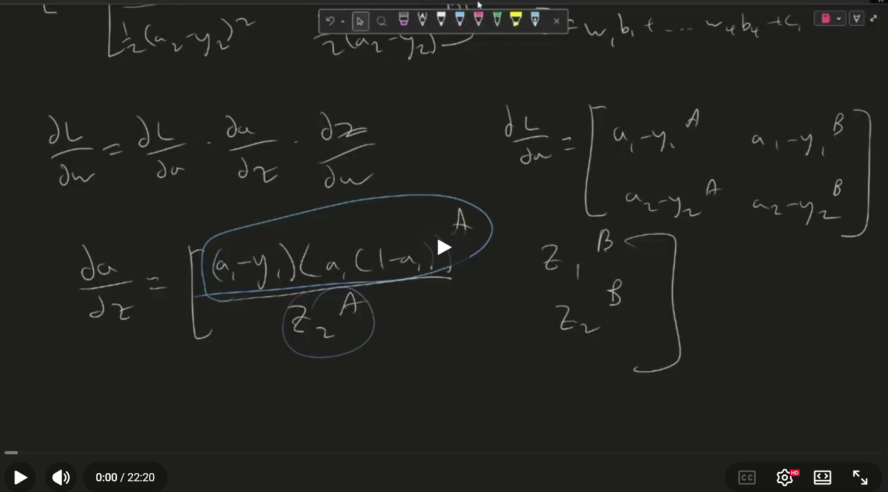

# Neural Network MNIST Classifier

A C++ feedforward neural network trained on the [MNIST](http://yann.lecun.com/exdb/mnist/) handwritten digit dataset, with a [raylib](https://www.raylib.com/) GUI for drawing digits and running live predictions.

The network is implemented from scratch using [Eigen](https://eigen.tuxfamily.org/). Saved weights reach **95.4%** test accuracy — you can often do better by tuning layer sizes or the early-stopping threshold in `neural_net.cpp`:

```cpp
if (epoch_accuracy > best_accuracy + 0.003)
```

## Demo

| Flow Chart | Video Explanation |
|:---:|:---:|
| .png) | [](https://youtu.be/fKm7jqmdumg) |

## Features

- **Custom MLP** — configurable layer sizes, ReLU hidden layers, softmax output
- **Cross-entropy training** — mini-batch SGD (batch size 32)
- **Early stopping** — held-out validation split with best-weight checkpointing
- **Model persistence** — save / load weights to `data/best_model.bin`
- **Interactive GUI** — draw digits with the mouse, preprocess like MNIST, classify in real time
- **Background training** — load or train on a worker thread while the window stays responsive

## Architecture

**Default network:** `784 → 256 → 64 → 10`

| Component | Detail |
| --- | --- |
| Input | 28×28 grayscale image (784 pixels) |
| Hidden layers | ReLU |
| Output layer | Softmax |
| Loss | Cross-entropy |
| Optimizer | Stochastic gradient descent |
| Learning rate | 0.005 |
| Batch size | 32 |

### Dataset split

| Split | Images |
| --- | ---: |
| Training | 48,000 |
| Validation | 12,000 |
| Test (official MNIST) | 10,000 |

## Hand-drawn digit preprocessing

To match MNIST normalization:

1. Capture the 280×280 drawing canvas
2. Find the bounding box of white ink pixels
3. Crop to that box
4. Scale to fit inside a 20×20 region (aspect ratio preserved)
5. Paste into a 28×28 black image, centered by center of mass at `(13.5, 13.5)`
6. Feed the resulting vector to the network

The right panel in the GUI shows the processed 28×28 input the network actually sees.

## Build & run

```bash
cmake -B build
cmake --build build
./build/main
```

Wait for **"Training not done, please wait"** to disappear before submitting a drawing.

### Configuration

Edit the constructor in `src/main.cpp` (line 23):

```cpp
NeuralNet net({784, 256, 64, 10}, 32, true, true);
```

| Argument | Meaning |
| --- | --- |
| `{784, 256, 64, 10}` | Layer sizes (first must be `784`, last must be `10`) |
| `32` | Batch size |
| `save_read` | `true` — load weights from `data/best_model.bin` on startup (skipped if missing or architecture mismatch); `false` — always reinitialize and train |
| `save_write` | `true` — overwrite `data/best_model.bin` on quit when training improves validation accuracy; `false` — leave the file unchanged |

## Controls

| Input | Action |
| --- | --- |
| Left mouse drag | Draw on the canvas (white on black) |
| `Enter` | Preprocess drawing and run prediction |
| `C` | Clear the canvas |
| `Q` | Quit (saves model weights on exit) |

Predictions appear below the processed-image preview on the right.

## Model file format

`data/best_model.bin` layout:

| Field | Type | Description |
| --- | --- | --- |
| `best_accuracy` | `float` | Best validation accuracy |
| `num_layers` | `int` | Number of entries in `layer_sizes` |
| `layer_sizes[]` | `int` × `num_layers` | Network architecture |
| Per layer | `double` weights, then `double` biases | Row-major weights followed by biases |
